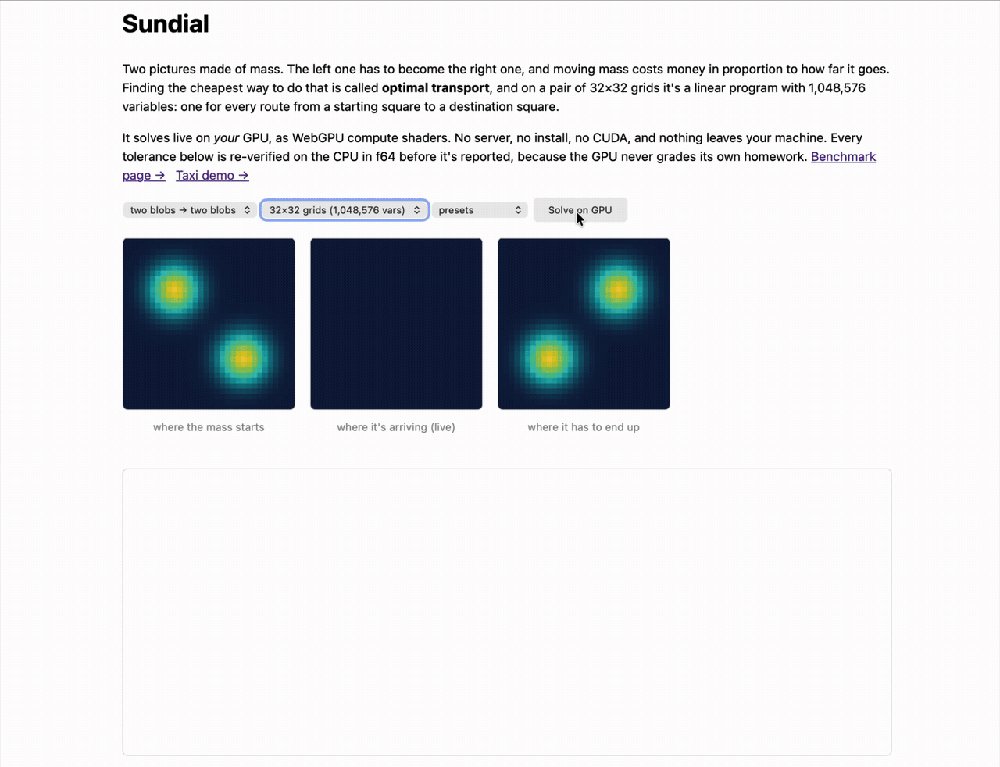

# Sundial

[](https://github.com/NMitchem/Sundial/actions/workflows/ci.yml)
[](#license)

A linear-programming solver that runs as WebGPU compute shaders, on any GPU:
Apple, AMD, Intel, NVIDIA. It runs natively through [`wgpu`](https://wgpu.rs),
and it runs in a browser tab through wasm. There's no CUDA anywhere in it.

The algorithm is restarted PDHG, the PDLP family, written in f32 WGSL with
matrix-free operators. The headline instance is optimal transport at
**1,048,576 variables**: two 32×32 grids, 1,024 sources against 1,024 sinks.
It solves to a verified 1e-4 in **9.4 seconds** on an Apple M4 Pro, and its
constraint matrix never exists in memory.

The browser costs you almost nothing. Native runs at 0.59 ms per iteration and
the tab runs at **0.547 ms**, which is inside measurement noise.

> **Live demo:** <DEMO_URL>



<details>
<summary><b>New to linear programming? Start here.</b></summary>

A linear program is an allocation question with limits attached. You have
things to hand out, a fixed amount of each, and a cost or a profit riding on
every choice. Solving it means finding the allocation no small change improves.

Airlines use it to assign crews to flights. Refineries use it to blend fuel,
grids use it to route power, and warehouses use it to decide who ships your
order. The theory has been settled since 1947, and the classical method is the
simplex algorithm, which is excellent and runs on a CPU.

The catch is scale. Simplex walks corner to corner along the problem's
boundary, one step at a time, and that walk is stubbornly sequential. When the
problem has a million variables you'd rather do a lot of cheap arithmetic all
at once, which is the one thing a GPU is built for.

That's what first-order methods do. PDHG never factors a matrix. Every
iteration is a sparse matrix-vector product and a few vector reductions, so all
1,048,576 variables move together on every step. You trade the exactness of
simplex for parallelism, and you get back roughly 4 correct digits instead of
16. For a transport plan measured in tons, 4 digits is the answer.

The `--grid 32` demo below is optimal transport: given a pile of mass in one
picture and a hole for it in another, move it for the least total cost. It's
the same shape of problem as matching drivers to riders, which is what
`taxi.html` does with real Manhattan data.

</details>

## Quick start

> **Not published yet.** `cargo install sundial-cli` and `npm install sundial-lp`
> are what the install will look like, and neither registry has the packages so
> far. Build from this repo until they do.

**In a browser.** Nothing to install, and nothing leaves your machine.

```bash
wasm-pack build crates/sundial-web --target web   # or: bash scripts/build_npm.sh
cd web && npm install && npm run dev
```

Three pages come up. `index.html` is the transport hero: 5 presets, or draw
your own source and target masses, with live heatmaps and a convergence chart.
`bench.html` takes a dropped `.mps` or `.mps.gz` and hands back an honest
results table. `taxi.html` dispatches every open ride in Manhattan from the
2015 NYC TLC record, greedily first and then to a CPU-verified optimum, and
you can tap the map to add yourself and watch the city re-plan.

**From Rust.** The smallest starting point is an LP you can check by hand:

```bash
cargo run --example tiny_lp
```

```rust
use sundial_core::problem::{LpProblem, SolveOptions, SolveStatus};

// A carpenter's day: 4 tables and 2 chairs, $26, every plank and hour used.
let solution = sundial_core::reference::solve(&lp, &SolveOptions::default(), &mut |_| {});
assert_eq!(solution.status, SolveStatus::Optimal);
```

**From the command line.** Native Metal, Vulkan, or DX12, whichever your
machine has:

```bash
cargo install sundial-cli

sundial solve crates/sundial-mps/tests/fixtures/afiro.mps
sundial transport --grid 32          # the 1,048,576-variable hero, ~9.4 s on an M4 Pro
sundial bench ./instances --out results.csv
sundial report results.csv --out report.md
```

**As a library.** The wasm build ships as the `sundial-lp` npm package:

```bash
npm install sundial-lp
```

```js
import init, { solveMps, webgpuAvailable } from "sundial-lp";

await init();
if (!webgpuAvailable()) throw new Error("WebGPU required");

const result = await solveMps(mpsText, 1e-4, (p) => console.log(p.iter, p.rel_gap));
console.log(result.status, result.objective);  // "Optimal (CPU f64 verified)"
```

You'll need WebGPU: Chrome or Edge 113+, Firefox 141+, Safari 26+.

## The rule: the GPU never grades its own homework

An f32 GPU solver has an obvious credibility problem. Single precision is
noisy, first-order methods crawl toward their tolerance, and declaring victory
a little early is easy and invisible. So Sundial has one rule it never breaks.

The GPU iterates, and the GPU *nominates*. It never sets a status.

`Optimal` is only ever returned after an independent CPU recheck in f64,
against the full KKT conditions, at the exact point being returned. The dual is
sign-projected first, so the duality gap is genuinely enforced on standard-form
problems rather than quietly dropped. `Infeasible` and `Unbounded` work the
same way: the GPU's streak detector nominates a candidate, a CPU-f64 Farkas
certificate (a dual ray, or a primal recession ray) either verifies it or
doesn't, and a failed verification resets the streak to zero.

The trade is deliberate. A missed detection costs you iterations and shows up
as an honest `IterationLimit`. A false status claim would cost you trust, and
the architecture makes it structurally impossible rather than unlikely.

## Results

**Netlib LP set, 32 instances**, GPU engine, default configuration:

| outcome | count | |
|---|---:|---|
| `Optimal`, CPU-f64 verified | 20 | every one within 1e-3 of the published optimum; worst real case is adlittle at 6.7e-4 |
| `IterationLimit` | 12 | honest non-solves, never dressed up as solves |
| parse failures | 0 | down from 1 in M1; `blend.mps` has a set-name-less RHS line that now parses |
| false `Optimal` | 0 | |

One footnote the report renders itself: **e226**. Its published optimum uses
the opposite sign convention for the objective-row RHS constant, so our
KKT-certified −11.635074 reads as a large relative error against the readme's
≈ −18.75. That's a convention mismatch, not a solver defect.

**Infeasibility recall is 2 of 6.** On Netlib's real infeasible set, itest2 and
galenet certify. The other 4 stop at `IterationLimit`. Zero produce a false
`Optimal`, which is the number that actually matters.

**Those 12 `IterationLimit` rows are not an f32 wall.** We said they were, and
we were wrong. Re-solving all 12 on the CPU f64 reference reproduces every
failure the same way, in double precision, where no 1e-4 floor exists. The real
cause is step imbalance: one residual collapses to machine epsilon while the
other stalls orders of magnitude above tolerance, and which side stalls flips
between instances. An opt-in movement-based primal weight (`--movement-weight`)
takes the same sweep to **30 of 32 with no status regressions**, and cuts
iterations **5.2×** across the instances that already solved.

It ships off by default, and the table above is the default-off run, because
the better headline hides a real cost. Two of the newly-`Optimal` instances,
lotfi and bnl1, land 5.8e-2 and 1.2e-2 from the published optima. Both are
honest `Optimal` by the KKT certificate. Both sit well outside the 1e-3 band
every row in that table occupies. Trading measurable accuracy for an
advertisable status count is the trade this project won't make quietly.

## What it can't do yet

- **f32 iterates, so 1e-4 is the tier.** That's PDLP's "moderate accuracy."
  Tighter is real future work.
- **Double-double precision is a closed experiment, not a backlog item.** We
  built df64, then wrote a test designed to falsify it, and it did. On Metal,
  forced fast-math proves `fma(a, b, -a*b) == 0` and folds every error term to
  zero at compile time, so df64 is byte-identical to plain f32 there. We traced
  that through wgpu-hal, naga's MSL backend, and the whole public wgpu 30
  surface: there's no control to turn it off. See
  [`docs/notes/df64-experiment.md`](docs/notes/df64-experiment.md).
- **No presolve.** GPU presolve (Cederberg & Boyd, arXiv 2604.23951) was
  evaluated and deferred. It only applies to the explicit-CSR path, never the
  matrix-free transport path, and a postsolve that preserves certificate
  honesty is multi-week correctness-critical work
  ([`docs/notes/gpu-presolve-memo.md`](docs/notes/gpu-presolve-memo.md)).
- **Simplex on a CPU still wins on small LPs.** That's expected. The GPU pays
  off at scale, which is what the million-variable hero is there to show.
- **No Python bindings.** The pitch is any GPU and zero install, and a wheel
  serves neither.

## Layout

Four crates, plus a separate demo app:

| path | what's in it |
|---|---|
| `crates/sundial-core` | the solver: problem types, Ruiz + Pock–Chambolle scaling, CPU f64 reference PDHG, KKT and Farkas verification, matrix-free `LinOp`, the wgpu engine and its WGSL kernels |
| `crates/sundial-mps` | MPS parser, plain or gzipped. Pure parser, no GPU or wasm dependencies |
| `crates/sundial-web` | wasm bindings. The directory is `sundial-web`, the crate and npm package are both **`sundial-lp`** |
| `crates/sundial-cli` | `sundial solve` / `transport` / `bench` / `report` |
| `web/` | Vite + TypeScript demo, three pages, importing the local wasm-pack output |

Current state and milestone history live in
[`docs/STATUS.md`](docs/STATUS.md). The long-form version of how this works and
why it didn't exist yet is [`docs/writeup.md`](docs/writeup.md). Design
documents are under [`docs/design/`](docs/design/).

## Building and testing

```bash
cargo test --workspace                        # CPU suite, which is what CI runs
cargo test --workspace -- --include-ignored   # + GPU suite, needs a real GPU
bash scripts/verify_clean_checkout.sh         # everything, from a scratch clone
```

GPU tests are `#[ignore]`d so CI stays green on GitHub's GPU-less runners. Run
them locally before believing a GPU change works, and run the 1M transport gate
in `--release`.

## Contributing

Read [`CONTRIBUTING.md`](CONTRIBUTING.md) first. It covers the build, the CI
gates, and the invariants a PR is held to. Open an issue before large changes:
several obvious-looking improvements are already closed experiments with the
reasoning written down in [`docs/notes/`](docs/notes/).

Security reports go through
[private vulnerability reporting](https://github.com/NMitchem/Sundial/security/advisories/new),
not public issues. See [`SECURITY.md`](SECURITY.md).

## License

MIT OR Apache-2.0, at your option. See [`LICENSE-MIT`](LICENSE-MIT) and
[`LICENSE-APACHE`](LICENSE-APACHE).

Bundled third-party data carries its own provenance: the Netlib LP fixtures and
the NYC TLC taxi extract are recorded in [`NOTICE`](NOTICE).
